# Documentação de Arquitetura

Esta documentação foi gerada a partir de múltiplas seções do repositório.

---

# Documentação de Architecture - cxm-distribution

O repositório **cxm-distribution** consiste em um serviço de agendamento e lembrete das distribuições. Abaixo serão detalhados os arquivos presentes no repositório e suas interações.

## Arquivos

### cmd/main.go

O arquivo `main.go` é o ponto de entrada da aplicação. Ele realiza a configuração do ambiente, estabelece conexões com banco de dados e serviços externos, inicia o serviço de fila, define os sinais de parada da aplicação e inicializa o logger. Além disso, verifica as configurações do ambiente e determina se o serviço de agendamento das distribuições será iniciado.

### cd/prod/deployment.yaml

O arquivo `deployment.yaml` é responsável por definir as configurações de implantação do serviço em um ambiente de produção. Ele cria um Deployment no Kubernetes que garante a disponibilidade do serviço `cxm-distribution` em um cluster. Define as réplicas, as configurações de recurso, a imagem a ser utilizada e as políticas de tolerância a falhas.

## Interações

O arquivo `main.go` interage com diversos pacotes e arquivos do próprio repositório, como `database`, `goredis`, `infra`, `services`, entre outros. Além disso, estabelece conexões com o AWS SQS para gerenciar as filas de distribuição. O arquivo `deployment.yaml` configura a forma como o serviço é implantado no ambiente de produção, garantindo a disponibilidade e escalabilidade necessárias.

## Padrões de Projeto

O projeto segue o padrão de design MVC (Model-View-Controller), separando as responsabilidades de modelo, visão e controle de forma a manter o projeto organizado e de fácil manutenção.

```mermaid
flowchart TD
    A[main.go] -- Configuração --> B((Database, Redis, Logger))
    B -- Conexões --> C(AWS SQS)
    B -- Verificação --> D(Condições de ambiente)
    A -- Sinais de parada --> E(Parar serviço)
    A -- Verificação de ambiente --> F(Serviço de agendamento)
    |---F ---> A
    G[deployment.yaml] -- Definição de implantação --> H(Kubernetes Cluster)
```

Esta é uma visão geral da arquitetura do serviço **cxm-distribution** com base nos arquivos presentes no repositório. Cada componente desempenha um papel crucial na execução adequada do serviço.
---

### Arquitetura de cd/prod/secret.yaml

O arquivo "cd/prod/secret.yaml" define um recurso do tipo ExternalSecret que contém informações sensíveis de configuração para o ambiente de produção do cxm-distribution. O recurso possui as seguintes propriedades:

- **refreshInterval**: Define o intervalo de atualização das informações do secret.
- **secretStoreRef**: Faz referência ao ClusterSecretStore "vaultproductionexternalsecret", que armazena os segredos de maneira segura.
- **target**: Especifica o nome do recurso de destino.
- **data**: Lista de pares secretKey e remoteRef, que mapeiam chaves de segredos com referências remotas.

As chaves de segredo incluem informações como AWS_ACCESS_KEY_ID, AWS_SECRET_ACCESS_KEY, AWS_REGION, ENVIRONMENT, entre outros.

### Arquitetura de cd/prod/service.yaml

O arquivo "cd/prod/service.yaml" define um recurso do tipo Service que expõe o serviço cxm-distribution-prod dentro do namespace "cxm". O serviço é do tipo ClusterIP, escutando na porta 80 e direcionando o tráfego para a mesma porta no backend.

### Arquitetura de cd/stage/deployment.yaml

O arquivo "cd/stage/deployment.yaml" descreve um deployment para o ambiente de stage do cxm-distribution. Ele especifica a criação de uma réplica do container "cxm-distribution-stage", com a imagem correspondente e configurações de recursos de CPU e memória. Além disso, define um ServiceAccount para autenticação, tolerâncias de falha e afinidades de nós.

### Interações entre os Componentes

O arquivo "cd/prod/secret.yaml" fornece as informações sensíveis necessárias para a execução do serviço cxm-distribution-prod, conforme especificado em "cd/prod/service.yaml". O Secret é consumido pelo serviço durante sua execução para acessar recursos como o AWS, filas do SQS e buckets do S3.

O deployment descrito em "cd/stage/deployment.yaml" cria uma instância do container "cxm-distribution-stage" para o ambiente de stage do cxm-distribution, utilizando as configurações definidas no Secret de produção.

### Padões de Projeto Utilizados

Os arquivos seguem a abordagem de separação de configurações sensíveis em Secrets, mantendo uma camada de segurança para proteger informações críticas. Além disso, o uso de Services, Deployments e ServiceAccounts segue padrões comuns para a implementação de microserviços em Kubernetes.

### Diagrama de Arquitetura

```mermaid
graph LR
  A[cd/prod/secret.yaml] -- Informações sensíveis --> B[cd/prod/service.yaml]
  A -- Consumo de secret --> B
  B -- Deployment -- C[cd/stage/deployment.yaml]
```
---

### Arquivos da seção de `cd/stage` e `ci`

Nesta seção, encontramos os arquivos que lidam com a configuração do ambiente de stage da aplicação `cxm-distribution`, bem como o pipeline de integração contínua.

#### Arquivo `cd/stage/secret.yaml`

O arquivo `secret.yaml` contém a definição de um `ExternalSecret` que armazena informações sensíveis do ambiente de stage do `cxm-distribution`, como chaves de acesso da AWS, configurações de log, filas do AWS SQS, entre outros. Ele faz referência a um ClusterSecretStore do Vault e configura o refreshInterval para 1 hora.

#### Arquivo `cd/stage/service.yaml`

O arquivo `service.yaml` define um `Service` do tipo ClusterIP para o `cxm-distribution-stage`, expondo-o na porta 80. Ele direciona o tráfego para o app `cxm-distribution-stage`.

#### Arquivo `ci/pipeline.yml`

O arquivo `pipeline.yml` representa o pipeline de integração contínua para o projeto `cxm-distribution`. Ele é configurado para ser acionado nas branches de `stage` e usa variáveis para controlar diversos aspectos da construção do pipeline, como o nome da aplicação, linguagem, imagem do Docker, entre outros. O pipeline também inclui um template chamado `kubernetes.yml` para o estágio de deploy em Kubernetes.

#### Interações entre os componentes

O `secret.yaml` contém informações sensíveis que são necessárias para a correta execução do `cxm-distribution-stage`. O `service.yaml` expõe o serviço para que ele seja acessível dentro do cluster. O arquivo `pipeline.yml` controla o fluxo de construção, teste e deploy da aplicação.

#### Padrões de projeto utilizados

- O padrão utilizado para armazenar informações sensíveis no arquivo `secret.yaml` é o de External Secrets, que permite que a aplicação acesse esses dados sensíveis de forma segura.
- No arquivo `service.yaml`, é utilizado o padrão de exposição de serviços em Kubernetes através de um Service do tipo ClusterIP, o que ajuda a manter a isolamento do serviço dentro do cluster.
- No `pipeline.yml`, é adotado o padrão de pipeline de CI/CD, com triggers configuradas para as branches corretas, variáveis para controlar diferentes aspectos da construção e um template para o deploy em Kubernetes.

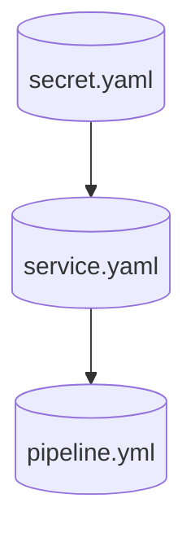

---

## Arquivos da seção de casos de uso de distribuição

### Arquivo: interfaces.go
Este arquivo contém as interfaces e estruturas de dados utilizadas nos casos de uso relacionados à distribuição.

**Componentes:**
- `SendMessageToDistributionProcessorInput`: Estrutura de dados para enviar mensagem ao processador de distribuição.
- `OrganizationInput`: Estrutura de dados para organização.
- `ProcessAvailableDistributionScheduleAndReminderInput`: Estrutura de dados para processar agendamentos e lembretes de distribuição.
- `ISendMessageToDistributionProcessorUseCase`: Interface para executar o envio de mensagem ao processador de distribuição.
- `IProcessAvailableDistributionScheduleAndReminderUseCase`: Interface para executar o processamento de agendamentos e lembretes de distribuição.


### Arquivo: processAvailableDistributionScheduleAndReminder.go
Neste arquivo, encontram-se os casos de uso relacionados ao processamento de agendamentos e lembretes de distribuição.

**Componentes:**
- `ProcessAvailableDistributionScheduleAndReminderUseCase`: Caso de uso para processar agendamentos e lembretes de distribuição.
- `sendMessageToDistributionScheduleAndReminderQueueInput`: Estrutura de dados para enviar mensagem à fila de agendamentos e lembretes de distribuição.
- `sQSMessageToDistributionScheduleAndReminderQueue`: Estrutura de dados para mensagem na fila de agendamentos e lembretes de distribuição.

**Padrões de Projeto:**
- Este arquivo demonstra o uso do padrão de projeto de Caso de Uso como uma forma de organização e encapsulamento da lógica de negócio relacionada aos agendamentos e lembretes de distribuição.


### Arquivo: sendMessageToDistributionProcessor.go
Este arquivo contém os casos de uso relacionados ao envio de mensagem ao processador de distribuição.

**Componentes:**
- Casos de uso para envio de mensagem ao processador de distribuição, com tratamento de erros e manipulação de dados.

**Padrões de Projeto:**
- Neste arquivo, podemos observar o uso do padrão de projeto de Caso de Uso, bem como boas práticas de manipulação de erros e tratamento de dados para o envio de mensagem ao processador de distribuição.

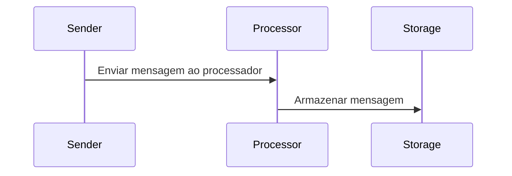

---

## Arquitetura da seção de distribuição

Nesta seção, são apresentados os seguintes componentes:

- `distribution.go`: Define a estrutura de dados e métodos relacionados à distribuição de mensagens.
- `distributionFile.go`: Define a estrutura de dados para arquivos de distribuição.

### Componentes da seção de distribuição:

#### `distribution.go`:
Este arquivo contém a definição da estrutura `Distribution`, que representa uma distribuição de mensagens. Além disso, ele define outras estruturas relacionadas, como `DistributionMap`, e tipos enumerados como `DistributionStatus` e `DistributionSenderType`. Também possui importações de outros pacotes e interfaces necessárias para o funcionamento adequado da distribuição.

#### `distributionFile.go`:
Neste arquivo, temos a definição da estrutura `DistributionFile`, que representa um arquivo associado a uma distribuição específica por meio do `DistributionUUID`.

### Interações entre os componentes:

- O arquivo `distribution.go` define a estrutura de dados e métodos relacionados à distribuição de mensagens.
- O arquivo `distributionFile.go` define a estrutura de dados específica para arquivos relacionados às distribuições.

### Padrões de projeto utilizados:

- No arquivo `distribution.go`, são utilizados padrões de design como composição e enumerações para representar os diferentes tipos de distribuições e mapeamentos.
- A separação de classes em arquivos separados segue o princípio de responsabilidade única, facilitando a organização e manutenção do código.

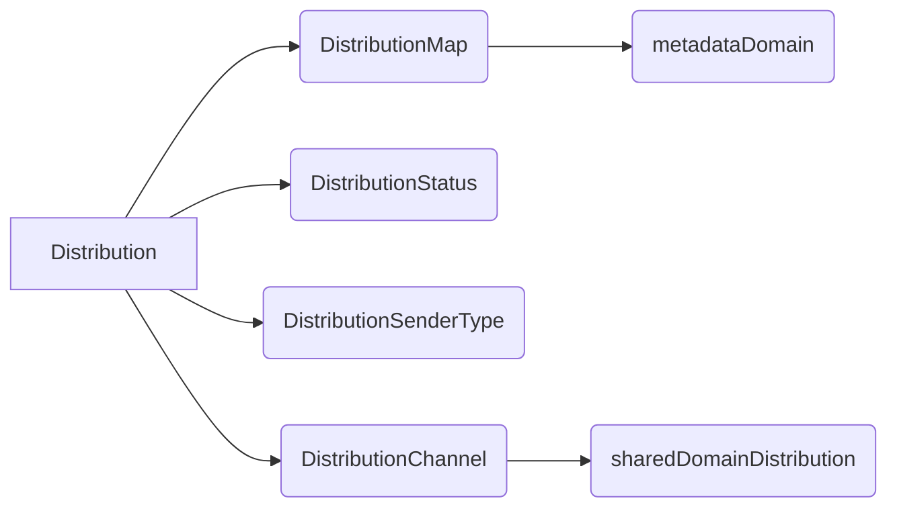

A representação acima mostra a relação entre os componentes da seção de distribuição. O `Distribution` contém `DistributionMap`, `DistributionStatus`, `DistributionSenderType` e `DistributionChannel`, estabelecendo a interação entre esses elementos.
---

## Componentes da seção de Distribuição

Nesta seção, temos os seguintes arquivos que fazem parte do domínio de distribuição:

1. `distributionQueue.go`: Define a estrutura `DistributionQueue` e suas variantes, além de constantes para os status e tipos de envio. Também inclui métodos para converter os enums em strings legíveis.
  
2. `repository.go`: Define a interface `DistributionRepositoryInterface` com métodos para encontrar, atualizar e manipular distribuições no repositório.
  
3. `distributionWhatsappTemplate.go`: Define a estrutura `DistributionWhatsappTemplate` para modelos de envio de mensagem via WhatsApp.

## Interações

- O arquivo `distributionQueue.go` é responsável por definir a estrutura e comportamento das filas de distribuição.
  
- O arquivo `repository.go` contém a interface que define operações de consulta e atualização no repositório de distribuição.
  
- O arquivo `distributionWhatsappTemplate.go` define a estrutura para modelos de mensagens de WhatsApp relacionadas à distribuição.
  
- As classes e estruturas desses arquivos se complementam no contexto de gerenciamento e manipulação de distribuições no sistema.

## Padrões de Projeto Utilizados

- Os arquivos seguem o padrão de projeto de arquitetura MVC (Model-View-Controller), onde o `distributionQueue.go` age como o modelo, `repository.go` como o controlador e `distributionWhatsappTemplate.go` como parte do modelo ou controlador, dependendo da implementação específica.

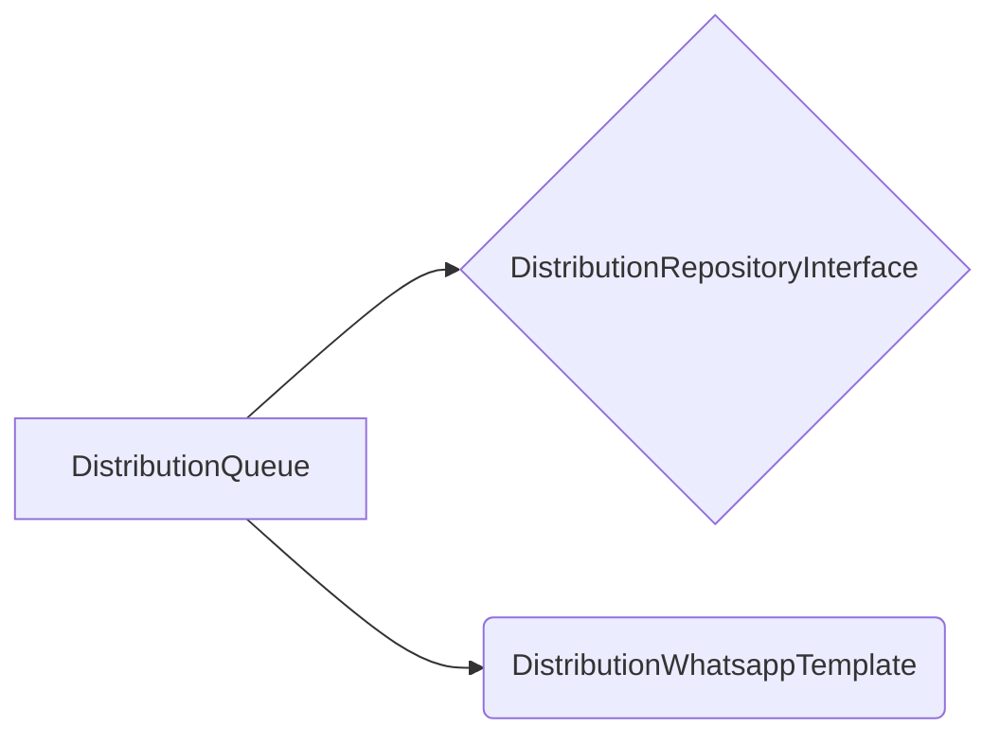

Esta representação básica mostra as interações entre os componentes da seção de Distribuição.
---

# Documentação da seção de "Interaction" do repositório Tracksale/cxm-distribution

## Arquivos da seção:
- **interaction.go**: Contém a definição da estrutura de dados relacionada a interações.
- **repository.go**: Contém a definição da interface do repositório de interações.
- **metadata.go**: Contém a definição da estrutura de dados relacionada a metadados.

## Componentes:
- **Interaction**: Representa uma interação entre um cliente e uma pesquisa. Contém informações como UUID, nome do cliente, UUID da pesquisa, canal de entrada/saída, status da interação, entre outros.
- **InteractionRepositoryInterface**: Interface que define os métodos para operações de persistência de interações.
- **Metadata**: Estrutura que representa metadados relacionados a perguntas ou respostas de interações. Contém informações como UUID, nome, tipo, tipo de dado, entre outros.

## Interações:
- A estrutura de **Interaction** usa tipos definidos em **sharedDomainDistribution** e **sharedDomainInteraction** para canais de distribuição e status de interação.
- A estrutura de **Metadata** usa o pacote **pq** para manipular arrays em formato de string no PostgreSQL.

## Padrões de Projeto:
- O código utiliza **gorm** para mapeamento objeto-relacional, facilitando a persistência dos dados.
- São utilizados tipos enumerados para representar tipos específicos de metadados e interações.

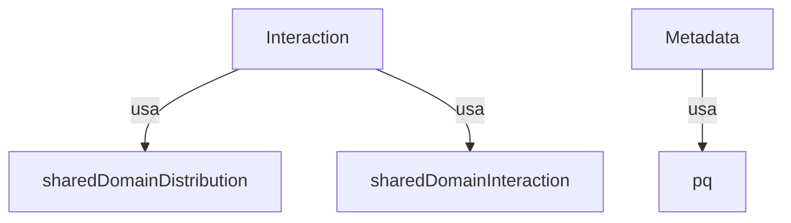

Esta seção do repositório lida principalmente com as definições de estruturas de dados relacionadas a interações e metadados, além de prover uma interface para operações de persistência. Os tipos e métodos definidos aqui são essenciais para o funcionamento do sistema de distribuição de interações da aplicação.
---

## Componentes da Seção 8: Repositórios e Domínio

Esta seção contém os seguintes arquivos:

1. **internal/domain/metadata/repository.go:** Define a interface MetadataRepositoryInterface com o método FindByUUIDSimplified para buscar metadados de forma simplificada.

2. **internal/domain/organization/organization.go:** Define a estrutura OrganizationDistributionProcessor, que representa um processador de distribuição de organização com diversos atributos, como UUID, identificador, logo, nome, configuração de banco de dados, nome do esquema, hash público, entre outros.

3. **internal/domain/organization/repository.go:** Define a interface OrganizationRepositoryInterface com o método GetActiveOrgs para obter organizações ativas.

## Interações entre os Componentes

- A interface `MetadataRepositoryInterface` definida em `repository.go` é responsável por buscar metadados simplificados.
- A estrutura `OrganizationDistributionProcessor` em `organization.go` representa um processador de distribuição de organização com atributos específicos.
- A interface `OrganizationRepositoryInterface` em `repository.go` é responsável por obter organizações ativas.

## Padrões de Projeto Utilizados

Nesta seção, os padrões de projeto utilizados são principalmente interfaces para definir contratos que devem ser seguidos pelas implementações dos repositórios e estruturas do domínio.

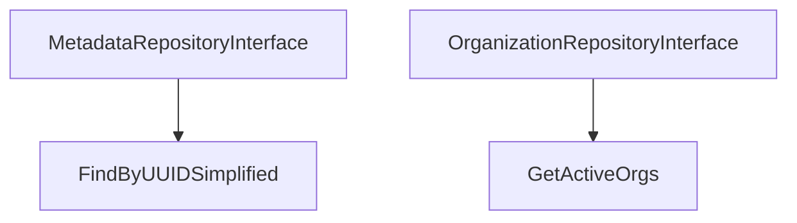

A representação acima é um diagrama Mermaid que mostra as interações entre os componentes da seção. A interface `MetadataRepositoryInterface` possui o método `FindByUUIDSimplified`, enquanto a interface `OrganizationRepositoryInterface` possui o método `GetActiveOrgs`.
---

## Arquitetura de infraestrutura de filas SQS

Nesta seção, temos os arquivos relacionados à infraestrutura de filas SQS (Simple Queue Service) utilizada no projeto.

### Componentes

1. **interfaces.go**: Define a interface `QueueInterface`, que contém os métodos para enviar mensagens, receber mensagens, alterar a visibilidade e deletar mensagens em uma fila SQS.

2. **sqs.go**: Implementa a interface definida em `interfaces.go`. O arquivo contém a estrutura `SqsQueue` que possui um cliente SQS e a função `NewSqsQueue` para criar uma nova instância da fila SQS.

### Interações

- O arquivo `interfaces.go` define a interface que especifica os métodos necessários para interagir com uma fila SQS.

- O arquivo `sqs.go` implementa a interface definida em `interfaces.go`, juntamente com a lógica para criar uma nova instância da fila SQS.

### Padrões de Projeto

O padrão Singleton é utilizado no arquivo `sqs.go` com a função `NewSqsQueue`. Ele garante que apenas uma instância da fila SQS seja criada e reutilizada em todo o sistema.

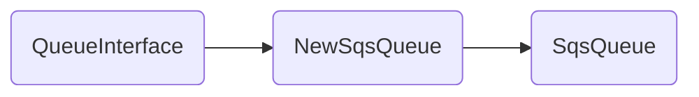

Esta representação em Mermaid mostra a interação entre a interface `QueueInterface`, a função de criação `NewSqsQueue` e a estrutura `SqsQueue`.
---

### Arquitetura do Repositório CXM Distribution

Nesta seção, serão documentados os arquivos relacionados aos repositórios internos responsáveis pela interação com o banco de dados e cache no contexto da distribuição de CXM.

#### Componentes

1. **gorm.go (internal/infra/repositories/distribution/gorm.go)**
   - Estrutura `DistributionRepository`
   - Struct `errorLog`
   - Métodos:
     - `FindByUUID(uuid string, optsFilters ...*qfilter.QFiltersParameters) (distributionDomain.Distribution, error)`
     - `IncrementErrorCounters(distUUID string, counters map[sharedDomainInteraction.InteractionErrorStatus]int) error`

2. **gorm.go (internal/infra/repositories/interaction/gorm.go)**
   - Estrutura `InteractionRepository`
   - Método `FindAllUnDoneInteractionsByDistribution(mainDistUUID, distUUID string)`
   - Função `NewInteractionRepository(nodeDBReadOnly *gorm.DB)`

3. **gorm.go (internal/infra/repositories/metadata/gorm.go)**
   - Estrutura `MetadataRepository`
   - Método `FindByUUIDSimplified(uuid string)`
   - Função `NewMetadataRepository(nodeDB *gorm.DB, cache cache.CacheInterface, cacheUniqueId string)`

#### Interações

- O `DistributionRepository` interage com o banco de dados para recuperar informações sobre as distribuições.
- O `InteractionRepository` possui métodos relacionados à interação com os dados das interações.
- O `MetadataRepository` é responsável por buscar informações simplificadas sobre metadados, interagindo com o banco de dados e o cache.

#### Padrões de Projeto

Os padrões de projeto utilizados parecem seguir o modelo Repository Pattern, com cada "Repository" sendo responsável por gerenciar a interação com uma entidade específica (distribuição, interação, metadados) no sistema.

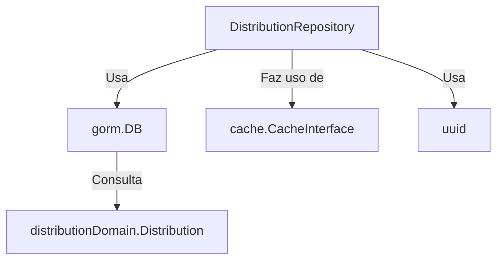
---

## Documentação da seção organization

### Componentes

#### `gorm.go`
- Pacote: organization
- Estruturas:
  - OrganizationRepository
- Funções:
  - GetActiveOrgs()
  - NewOrganizationRepository()

### Interações

O arquivo `gorm.go` define a estrutura `OrganizationRepository` que contém um ponteiro para um objeto `gorm.DB` e implementa o método `GetActiveOrgs()` para buscar organizações ativas no banco de dados. Além disso, a função `NewOrganizationRepository()` cria uma instância do repositório de organizações.

#### `distributionCronService.go`
- Pacote: services
- Estruturas:
  - DistributionCronService
- Funções:
  - Start()

O arquivo `distributionCronService.go` define a estrutura `DistributionCronService`, que é responsável por realizar operações agendadas relacionadas à distribuição de mensagens. A função `Start()` inicia o serviço de cron de distribuição.

#### `sendMessageToDistributionProcessorConsumer.go`
- Pacote: sqsHandler
- Estruturas:
  - SendMessageToDistributionProcessorConsumer
- Variáveis:
  - maxNumberOfMessagesSendMessage
  - visibilityTimeoutSendMessage
  - waitTimeSecondsSendMessage

O arquivo `sendMessageToDistributionProcessorConsumer.go` define a estrutura `SendMessageToDistributionProcessorConsumer`, responsável por enviar mensagens para o processador de distribuição. O código inclui a definição de variáveis para controle dos parâmetros de envio de mensagens por SQS.

### Padrões de Projeto

Nesses arquivos, podemos observar o uso do padrão Repository para abstrair a camada de persistência dos dados das organizações e das mensagens a serem distribuídas. Além disso, a utilização de interfaces e injeção de dependência permite a flexibilidade na troca de implementações de diferentes utilizadores.

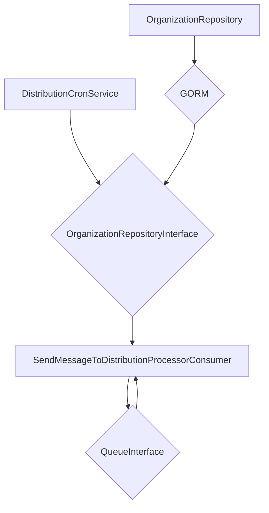
---

# Arquitetura de Armazenamento e Validação

Nesta seção do repositório `Tracksale/cxm-distribution`, encontramos três arquivos que lidam com operações de armazenamento e validações para a aplicação de distribuição.

## `internal/infra/storage/interfaces.go`

Este arquivo define a interface `IS3Client` que representa um cliente para interagir com o serviço de armazenamento S3 da AWS. Possui métodos para obter, inserir e verificar a existência de objetos no S3.

## `internal/shared/application/distribution/validations.go`

O arquivo `validations.go` contém funções para validar emails e números inteiros. Utiliza uma expressão regular para validar endereços de e-mail conforme as recomendações do link fornecido nos comentários.

## `internal/shared/common/typingUtil.go`

Já o arquivo `typingUtil.go` fornece uma função `GetOnlyNumbers` que remove todos os caracteres não numéricos de uma string, deixando apenas os números.

### Interações

A aplicação de distribuição utiliza as funções de validação de email e números inteiros para garantir que as informações inseridas sejam válidas antes de serem armazenadas no S3.

### Padrões de Projeto

Os arquivos desta seção seguem o padrão de projeto Interface para definir a interação com o serviço de armazenamento S3, o que facilita a manutenção e testabilidade do código.

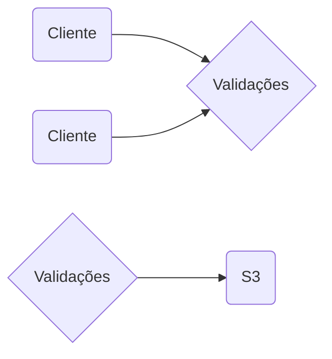
---

## Arquivos da seção de arquivos compartilhados

Nesta seção do repositório, os seguintes arquivos estão presentes:

### Arquivo: zeroValue.go
O arquivo `zeroValue.go` está localizado em `internal/shared/common` e contém a lógica para verificar se um valor é zero. Ele define a variável de erro `ZeroValErr` e a função `IsZeroVal` que verifica se um valor é zero.

### Arquivo: env_config.go
O arquivo `env_config.go` está localizado em `internal/shared/config` e contém definições para carregar e manipular variáveis de ambiente. Ele utiliza a biblioteca `godotenv` para carregar variáveis de um arquivo `.env` e define a estrutura `EnvVars` que mapeia variáveis de ambiente para campos específicos.

### Arquivo: distribution.go
O arquivo `distribution.go` está localizado em `internal/shared/domain/distribution` e define um tipo `DistributionChannel` e várias constantes relacionadas a canais de distribuição. Ele também inclui métodos para verificar se um canal é de despacho ou não, além de um método para converter o canal em uma string representativa.

### Interações entre os arquivos
- O arquivo `env_config.go` é responsável por carregar e manipular variáveis de ambiente, que podem ser essenciais para o funcionamento do sistema.
- O arquivo `distribution.go` define os canais de distribuição e fornece métodos para verificar e converter esses canais.

### Padrões de projeto utilizados
- O arquivo `env_config.go` segue o padrão Singleton, garantindo que a carga das variáveis de ambiente aconteça apenas uma vez.
- O arquivo `distribution.go` segue o padrão Enum, representando os diferentes canais de distribuição como constantes numéricas.

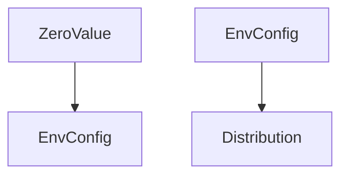

Esta seção do repositório lida com os aspectos compartilhados do código, como manipulação de variáveis de ambiente e definição de tipos comuns. Os arquivos presentes aqui fornecem funcionalidades essenciais para o sistema como um todo.
---

## Arquitetura do `cxm-distribution`

### `interaction.go`

O arquivo `interaction.go` contém a definição do tipo `InteractionErrorStatus` e as constantes relacionadas a status de erro em interações.

### `gormTransaction.go`

O arquivo `gormTransaction.go` contém uma função `ExecuteTransaction` que facilita a execução de transações utilizando o ORM Gorm.

### `logger.go`

O arquivo `logger.go` implementa a estrutura de logging com o pacote `go.uber.org/zap`. Ele define um logger com contexto e métodos para diferentes níveis de log.

### Interações entre os componentes

- O arquivo `interaction.go` define os status de erro em interações que podem ser logados pelo logger do arquivo `logger.go`.
- O arquivo `gormTransaction.go` facilita a execução de transações que podem gerar logs pelo logger.
- O arquivo `logger.go` implementa a funcionalidade de logging que pode ser utilizado em várias partes do código, inclusive para logar erros em transações definidas em `gormTransaction.go`.

### Padrões de projeto utilizados

- Singleton: O logger é inicializado apenas uma vez e depois reutilizado em todo o código, garantindo que apenas uma instância do logger seja utilizada.
- Strategy: A função `updateFields` em `loggerWithContext` permite a flexibilidade de adicionar campos adicionais aos logs de forma dinâmica.

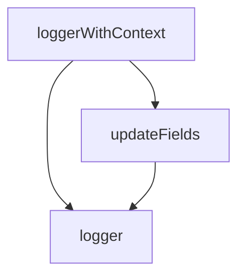
---

## Arquivo: internal/shared/infra/logger/loggerInterface.go

Este arquivo contém a definição de uma interface LoggerInterface que representa um logger genérico, com métodos para registrar mensagens de diferentes níveis de severidade.

### Componentes
- **LoggerInterface**: Interface que define os métodos Error, Warn, Fatal, Info e Debug para registrar diferentes tipos de mensagens de log.

### Interações
Os métodos da interface LoggerInterface são utilizados por diferentes partes do sistema para a realização de logs de eventos e erros. Cada método corresponde a um nível de severidade da mensagem a ser registrada.

### Padrões de Projeto
Este arquivo segue o padrão de design de Interface, que permite a abstração das funcionalidades de logging para que diferentes implementações possam ser utilizadas sem a necessidade de alterar o código que faz uso da interface.

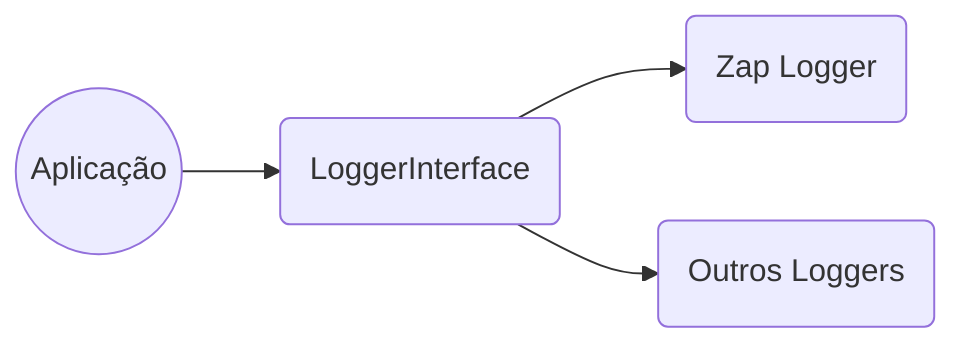

Esta representação visual mostra como a aplicação interage com a interface LoggerInterface, que por sua vez pode ser implementada por diferentes loggers, como o Zap Logger ou outros loggers específicos. O uso da interface permite a troca fácil de implementações de loggers sem afetar o restante da aplicação.